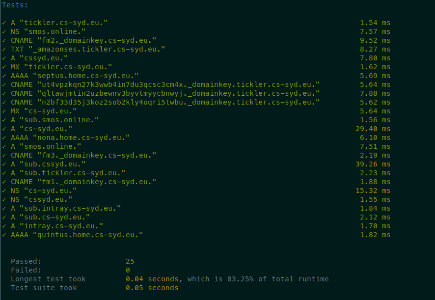

# DNSCheck

A declarative DNS checker to run continuously for monitoring.

This way you can make sure that you've set your DNS records correctly, and that they do not somehow disappear.


1. Write a spec file `spec.yaml` like this:

```
checks:
- type: a
  domain: cs-syd.eu
  ip: 52.211.121.166
- type: mx
  domain: cs-syd.eu
  values:
    - 10 in1-smtp.messagingengine.com.
    - 20 in2-smtp.messagingengine.com.
```

2. Run `dnscheck spec.yaml`

   The exit code will be `1` if any of the specified DNS records do not match what has been looked up, and the output will look like this:

   


See the 'examples' directory for more example specifications.

